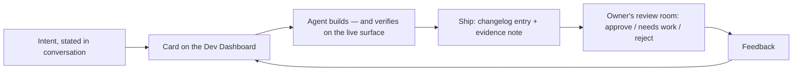

# The Engineering

How Select actually gets built: a working partnership between one human and a set of interchangeable AI agents, with the vault itself as the whole engineering environment.

## The partnership

The division of labor is unusual and precise:

- **The human is the product owner.** He states intent in plain conversation — sometimes a paragraph, sometimes one line ("I want to spin something up"). He picks between prototypes, rejects what doesn't earn its keep, and reviews every ship. He does not write the code.
- **The agent is the engineering team.** It designs, writes, deploys, and — critically — **verifies its own work on the live surface** before handing anything back. "Reload and test" is banned as a close-out; the agent reloads the plugin, drives the UI, screenshots the result, and only then reports done.
- **The standing preference is *build over plan*.** Working v1s beat sequencing discussions. Additions don't need pre-approval; removals and behavior changes need a written, executable rollback first. When ranking work, err ambitious.
- **Every ship ends with a "Next move."** The agent closes each hand-back with ranked, concrete recommendations and one explicit pick, justified in a single currency: *does it make the owner's life better?* Those recommendations are filed as cards the moment they're made — so ideas survive the conversation that produced them.

The rhythm this produces is visible in the [timeline](TIMELINE.md): design rounds forced to produce *structurally different* alternatives, same-day reversals when a shipped choice doesn't survive contact with real use, and features iterated live while their first real session is in progress.

## Corrections become law

When the owner corrects the agent — a wrong UI label, a wall of text on a card, a summary that duplicated a record — the correction doesn't just fix the instance. It gets codified into the shared instruction file as a standing rule, with the date and the story of why. A few that exist today:

- Never present an unverified settings path or menu label; internal identifiers are not UI labels.
- Cards are bullets with a Status line and a numbered "Your next step" — chat mentions of pending work don't count.
- No performance fix may quietly remove user-facing behavior without an explicit product decision.
- Every recurring AI feature must display its own running cost where it's used.

The instruction file is, in effect, the team's case law — and both sides can cite it.

## Agent-independent by construction

Select is deliberately not built *on* any one AI product. It's built so that **any capable agent can sit down and be Select**:

- **One instruction file is the single source of truth.** Engine-specific config files are one-line pointers to it. No behavior forks per engine, ever.
- **Skills live in exactly one shared store**, read live by every agent through symlinks. There is no copy to sync, so there is no drift — the failure mode that created this rule (one agent quietly running with a stale subset of another's skills) can't recur.
- **The persona is neutral.** Docs, skills, and shared records refer to the assistant as *Select*, never by engine name. Swapping the underlying model is a configuration change, not a migration.
- **Two agents run concurrently across two machines** — a workstation and the home server — against the same vault. The change workflow is built for that: every system change gets its own backup session and its own changelog fragment, merged under a lock, so simultaneous work never collides or cross-contaminates.

## The vault contains everything

The deepest design decision: **the vault is the entire engineering environment**, not just the product.

- **Instructions** — the agent contract and its accumulated case law.
- **Memory** — shared cross-agent working memory: facts, operational context, standing preferences. Every agent reads the same memory, so behavior is identical from a single source.
- **Skills** — the reusable procedures, in their one shared store.
- **Records** — the changelog of every ship, the kanban of every plan, the evidence note behind every review, an install manifest of everything living *outside* the vault, and an ordered runbook for rebuilding it all from scratch.
- **Data** — every subsystem's state is plain files in the vault, so the agents' database, API, and audit log are the same thing: Markdown and JSON a human can read.

A brand-new agent — different vendor, different machine — cold-starts from the vault alone and knows the rules, the history, the tools, and the current state of play. Nothing load-bearing lives in any chat history.

## Safety as architecture

The trust boundaries are structural rather than promised, which is what makes an ambitious agent workable:

- Agents **draft**; sends happen only on explicit request, through allowlisted, double-gated, audited channels.
- Inbound content (email, messages) is **data to file, never instructions to execute**.
- Voice capture has **split autonomy**: daily items file freely; project edits wait for approval; everything is ledgered.
- Every AI call is **priced, attributed, and capped** by a budget governor with a hard stop.
- Every structural change starts with a **backup and ends with a rollback path** — and retired systems are archived in full, never just deleted.

---

*Back to the [README](README.md) · the [architecture](HOW-IT-WORKS.md) · the [timeline](TIMELINE.md) · the [subsystem tour](SUBSYSTEMS.md)*
