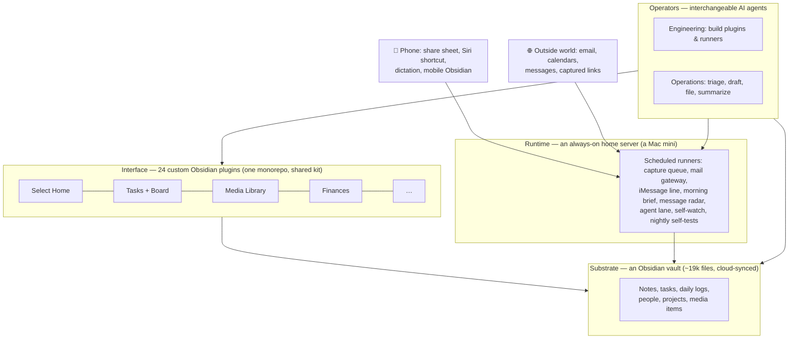

# How Select Works

No code in this repo — this is the architecture in prose, at the level of detail that transfers.

## The stack, in one diagram

Four layers, one rule: **everything bottoms out in plain Markdown files.** Every app is a view; every automation writes notes a human could have written by hand.

## The subsystem pattern

Select's unit of construction is the **subsystem**:

> **plugin surface + vault-backed records + agent write path**

A subsystem is a UI the human uses, files that hold its state (readable and editable outside the plugin forever), and a scripted entry point an agent can call. The Dev Dashboard, the Comms gateway, the Media Log, Finances, and Intentions are all this same shape. When the third one appeared, the pattern got a name; new capabilities are now commissioned *as* subsystems.

## One routing brain, channel-agnostic by construction

Every way of talking to the system — Siri dictation, iMessage (one-to-one or in a group thread), a quick-capture line on the phone, an emailed instruction, a sentence in a recorded thinking session — funnels into a single parse-and-route layer, **Select Routing**, before anything is written anywhere. The channels are mouths; the brain is shared. That's a construction decision, not a convention:

- **One route core, not N parsers.** Chat transports call the same routing function; a new channel must plug into it, never fork it. The alternative — per-channel routing that drifts one bugfix at a time — is the failure mode the rule exists to kill.
- **Deterministic executors under a model parser.** Word-matching handles the obvious cases for free; a schema-bound intent pass interprets the rest, but can only *name* a door from a closed set and fill its slots. Writes happen exclusively through the doors' own primitives; person resolution and the first-name trust gate never involve a model; non-commands default to conversation.
- **Parity is enforced, not hoped for.** The layer exists as two synchronized implementations — server-side for voice/chat/email, in-app for capture surfaces — pinned to one shared vocabulary and one fixture suite. A release gate replays 679 fixture checks across thirty-one channels in both implementations (no writes, no network) and fails the release on any divergence. When the owner corrects a mis-route, the correction becomes a fixture in that suite — behavior is hardened by regression pins, never by growing word lists.
- **Receipts tell the truth, and nothing is silently lost.** A reply confirms a write only when the write result says it happened — a duplicate or an ambiguous match refuses instead of guessing, and offers no undo for a write that never occurred. When the router is only guessing, the item lands in the day's log, never in canonical records; replying "No — …" undoes the last write and re-routes it; and a message the system couldn't understand is filed exactly as sent, with a task that checks itself off once a later replay handles it.
- **Time windows gate safety, never comprehension.** Every message is read against its thread's recent history, so a late reply or a correction is still understood after any timer has expired — timers only decide what the system is *allowed* to do, not what it can understand.

The payoff is the product bar this system is now measured against: for routine commands, notes, and tasks, you shouldn't be able to tell which channel you're in — because underneath, there is only one.

## Agents as the engineering team

The distinctive part of Select isn't the plugins — it's who built them and how.

- **Agent-agnostic by construction.** A single instruction file is the source of truth for every agent; skills live in one shared store read live through symlinks. Any agent (or two at once, on two machines) behaves identically. When the vault was found drifting toward one agent's tooling, that became the invariant: *no per-engine forks*.
- **One record per event.** Every system change runs through a concurrency-safe workflow: backup first, per-session changelog fragment, merged under a lock. Ships go in the changelog; planning goes on the Dev Dashboard; the daily log belongs to the human. A fact stored twice is drift waiting to happen.
- **The dev cycle is a subsystem too.** Agent recommendations are filed as kanban cards the moment they're made, so ideas stop dying in chat transcripts. A card can't reach "Shipped" without a written evidence note; a review room walks the human through every ship one card at a time with approve / needs-work / reject verdicts. Feedback from each review becomes the next queue.
- **Verify your own work.** Agents must reload the plugin, restart the runner, drive the UI (including a mobile-emulation harness), and confirm the changed behavior themselves. "Reload and test" is not an acceptable hand-back — and "it was only content" is not an exemption: verification follows whatever the human will actually look at.
- **The test path is infrastructure.** A nightly self-test proves agents can still open, drive, and close a verification session on the server, and reports a red row naming the failed step. A broken verification path is the task, not a blocker to report. Test suites run behind a write fence: any test that touches the real vault, machine state, or the live message outbox fails by name — deliberately uncatchable by a production catch-all handler.
- **Friction is logged, not remembered.** A shared papercuts log, read by every agent engine, records each thing that cost a session time — symptom, fix, project. When tooling fails mysteriously, it is the first thing checked; a repeat is marked on the existing line, not re-discovered.

## Autonomy, bounded structurally

Trust is designed in, not promised:

- **Drafts, never sends.** The agent task lane produces reviewable draft notes; outbound email and messages happen only on explicit request, through allowlisted, double-gated, audited channels.
- **Message bodies are data, never instructions.** Inbound mail is triaged from an allowlist of known senders; content is filed, not executed.
- **Authority is tiered by sender.** The owner has full reach; a household tier gets shared-life records and conversation with its own isolated memory, but never code, configuration, credentials, payments, irreversible confirmations, or the owner's private thread. Group threads are refused if any member is off the allowlist, and private memory stays out of shared threads. The boundary is pinned in the routing contract, and a read-only audit panel shows each sender's tier — never message contents.
- **One prompt a day.** The morning brief, delivered by iMessage, is the only message Select starts on its own. Everything else is a reply.
- **Money records move in reversible batches.** Any change to an external accounting system needs a verified backup first, a per-entry audit event in a hash-chained log, and undo by batch or by entry. Corrections an investigation finds stay unposted proposals until one whole-picture review covers them all — no piecemeal posting, no plug figures.
- **Split autonomy.** Voice-captured items file freely into daily logs; anything touching project files requires approval — with a full action ledger either way.
- **Every AI call is priced.** A shared model-steering config, per-channel 30-day cost cards, and a budget governor with a hard stop. New recurring AI features must display their own cost where they're used.
- **Read-only where read-only is enough.** The calendar layer ingests but never writes back; new cockpits ship read-only first because they're cheap to be wrong about.

## The server

An always-on machine at home runs the whole background layer as native scheduled jobs: media capture, mail triage, Select's own iMessage line (with a daily self-ping that proves delivery, because a send counter is not a delivered message), the morning brief, the missed-message radar, the agent work lane, a network watch that texts once when a mesh node drops and once when it returns — plus an hourly vision check on its own console screen, because status files only report what code thought to measure. Configured for unattended recovery: auto-restart after power loss, auto-login, remote access over a private mesh VPN with key-only, command-restricted SSH for the voice channel.

## Mobile, by decision — not by default

Nearly the whole fleet (23 of 24 plugins) now runs on the phone, and that ratio is a set of deliberate calls, not an accident of what happened to work — an August round of "mobile flips" brought the finance surfaces, the coaching portal, the podcast library, and the document library to the phone one decision at a time. The question asked of every surface: **where is the human actually standing when this is useful?**

- **Capture must work from the phone, always.** Every door into the vault is phone-first: the share sheet into the media library, dictation straight into the daily log (including a fully offline path), the Siri voice channel, mobile task capture. A capture system that needs a desk is a capture system that misses everything.
- **Review works from the couch.** Task triage, the review decks, the journal, the people and travel cockpits, the dev board's sign-off room — all verified on a phone viewport before any ship, via a mobile-emulation harness (with real-device cold starts as final sign-off). Working a queue is a sofa activity.
- **Deep work stays at the desk — on purpose.** Surfaces that go mobile do so as a decision, and what stays behind stays behind deliberately: the desk-microphone voice-processing surface remains desktop-only (the phone's door into it is simply texting Select a voice memo), and mobile versions of dense screens ship as their own designs (the phone gets the document *library*, not the intake workbench). A cramped phone rendering of a dense screen serves nobody.
- **The phone budget is real.** Mobile Obsidian lives under an OS memory ceiling — a single greedy full-text-index plugin once put the app into a silent reload loop until forensics traced it. Since then, every plugin earns its place on the phone; anything that can't justify its mobile memory footprint gets the desktop-only flag.

So "is it mobile-optimized?" gets answered per-surface at design time, recorded in the plugin manifest, and enforced by the pre-ship verification pass — the standing product lens is called **mobile parity**, and skipping it takes a written justification.

## Why Obsidian / plain files

- **Longevity.** The notes predate Select by years and will outlive any plugin.
- **Leverage.** Agents are excellent at reading and writing Markdown; the vault is simultaneously the database, the API, and the audit log.
- **Exit.** Abandon every plugin tomorrow and nothing is lost — the system degrades gracefully back into a folder of readable files.
