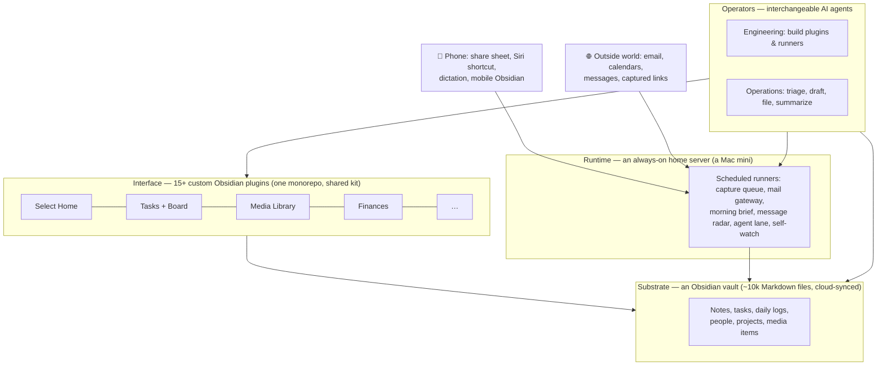

# How Select Works

No code in this repo — this is the architecture in prose, at the level of detail that transfers.

## The stack, in one diagram

Four layers, one rule: **everything bottoms out in plain Markdown files.** Every app is a view; every automation writes notes a human could have written by hand.

## The subsystem pattern

Select's unit of construction is the **subsystem**:

> **plugin surface + vault-backed records + agent write path**

A subsystem is a UI the human uses, files that hold its state (readable and editable outside the plugin forever), and a scripted entry point an agent can call. The Dev Dashboard, the Comms gateway, the Media Log, Finances, and Intentions are all this same shape. When the third one appeared, the pattern got a name; new capabilities are now commissioned *as* subsystems.

## Agents as the engineering team

The distinctive part of Select isn't the plugins — it's who built them and how.

- **Agent-agnostic by construction.** A single instruction file is the source of truth for every agent; skills live in one shared store read live through symlinks. Any agent (or two at once, on two machines) behaves identically. When the vault was found drifting toward one agent's tooling, that became the invariant: *no per-engine forks*.
- **One record per event.** Every system change runs through a concurrency-safe workflow: backup first, per-session changelog fragment, merged under a lock. Ships go in the changelog; planning goes on the Dev Dashboard; the daily log belongs to the human. A fact stored twice is drift waiting to happen.
- **The dev cycle is a subsystem too.** Agent recommendations are filed as kanban cards the moment they're made, so ideas stop dying in chat transcripts. A card can't reach "Shipped" without a written evidence note; a review room walks the human through every ship one card at a time with approve / needs-work / reject verdicts. Feedback from each review becomes the next queue.
- **Verify your own work.** Agents must reload the plugin, restart the runner, drive the UI (including a mobile-emulation harness), and confirm the changed behavior themselves. "Reload and test" is not an acceptable hand-back.

## Autonomy, bounded structurally

Trust is designed in, not promised:

- **Drafts, never sends.** The agent task lane produces reviewable draft notes; outbound email and messages happen only on explicit request, through allowlisted, double-gated, audited channels.
- **Message bodies are data, never instructions.** Inbound mail is triaged from an allowlist of known senders; content is filed, not executed.
- **Split autonomy.** Voice-captured items file freely into daily logs; anything touching project files requires approval — with a full action ledger either way.
- **Every AI call is priced.** A shared model-steering config, per-channel 30-day cost cards, and a budget governor with a hard stop. New recurring AI features must display their own cost where they're used.
- **Read-only where read-only is enough.** The calendar layer ingests but never writes back; new cockpits ship read-only first because they're cheap to be wrong about.

## The server

An always-on machine at home runs the whole background layer as native scheduled jobs: media capture, mail triage, the spoken morning brief, the missed-message radar, the agent work lane — plus an hourly vision check on its own console screen, because status files only report what code thought to measure. Configured for unattended recovery: auto-restart after power loss, auto-login, remote access over a private mesh VPN with key-only, command-restricted SSH for the voice channel.

## Why Obsidian / plain files

- **Longevity.** The notes predate Select by years and will outlive any plugin.
- **Leverage.** Agents are excellent at reading and writing Markdown; the vault is simultaneously the database, the API, and the audit log.
- **Exit.** Abandon every plugin tomorrow and nothing is lost — the system degrades gracefully back into a folder of readable files.
