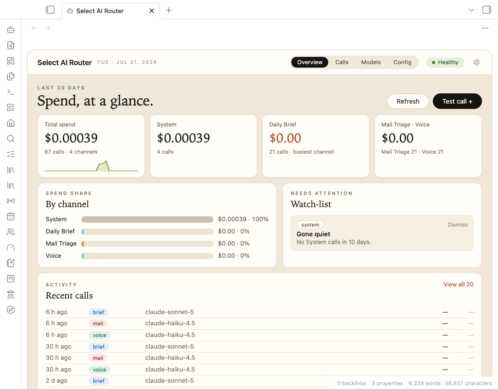

# Select

**A personal operating system, built inside an Obsidian vault, operated by AI agents.**

Select is not a product. It's one person's working life — tasks, calendar, people, media, finances, goals, communications — run through a single 10,000-note Markdown vault, with fifteen-plus custom plugins as the interface and AI agents as the engineering team, the operations staff, and the librarian.

This repo contains no code. It's a demonstration: screenshots, recordings, architecture notes, and the real, dated history of how the system was built. The short version of that history is the reason this repo exists — **the application layer, the server runtime, the agent workflow, and most of the subsystems below were built in about three weeks of evenings**, through conversation.

---

## What it does today

Every one of these is a live surface used daily, not a demo:

| Subsystem | What it does |
|---|---|
| **Select Home** | Native homepage: app dock, capture line, daily verse with one-tap reflection journaling |
| **Select Tasks + Board** | Task app over plain Markdown checkboxes; a kanban with a **Select lane** — drag a card there and an agent drafts the work within five minutes |
| **Media Log** | Always-on capture pipeline: share a link from a phone, a server ingests it into a browsable 2,500+ item library with live embeds |
| **Comms** | Select has its own email address and phone presence — triaged mail gateway, missed-message radar over iMessage with named threads and in-app replies |
| **AI Router** | Every AI call in the ecosystem priced, attributed, and budget-capped — model steering per surface, spend at a glance, a governor with a hard stop |
| **Calendar + People** | Read-only family calendar layer; a CRM that harvests @mentions from notes instead of demanding data entry |
| **Voice** | Spoken morning brief; "Hey Siri, Ask Select" from a phone over a secured tunnel; dictated thinking sessions that file themselves |
| **Finances** | A living balance sheet from raw exports: every account, penny-reconciled stock lots, an honest index benchmark |
| **Intentions** | Consent-based goal review — every goal gets a periodic verdict, so silent abandonment is structurally impossible |
| **Dev Dashboard** | The dev cycle itself as a kanban: agent recommendations land as cards, ships require evidence, review is a click-through room |

<table>
  <tr>
    <td width="25%"><a href="https://cobbenterprises.github.io/select-showcase/SUBSYSTEMS.html#select-home"> <b>Home</b></a></td>
    <td width="25%"><a href="https://cobbenterprises.github.io/select-showcase/SUBSYSTEMS.html#select-tasks--board"> <b>Tasks + Board</b></a></td>
    <td width="25%"><a href="https://cobbenterprises.github.io/select-showcase/SUBSYSTEMS.html#media-log"> <b>Media Library</b></a></td>
    <td width="25%"><a href="https://cobbenterprises.github.io/select-showcase/SUBSYSTEMS.html#finances"> <b>Finances</b></a></td>
  </tr>
  <tr>
    <td width="25%"><a href="https://cobbenterprises.github.io/select-showcase/SUBSYSTEMS.html#comms"> <b>Comms</b></a></td>
    <td width="25%"><a href="https://cobbenterprises.github.io/select-showcase/SUBSYSTEMS.html#ai-router"> <b>AI Router</b></a></td>
    <td width="25%"><a href="https://cobbenterprises.github.io/select-showcase/SUBSYSTEMS.html#intentions"> <b>Intentions</b></a></td>
    <td width="25%"><a href="https://cobbenterprises.github.io/select-showcase/SUBSYSTEMS.html#dev-dashboard"> <b>Dev Dashboard</b></a></td>
  </tr>
</table>

Every pixel above is real plugins over fictional data: screenshots come from a sanitized demonstration vault (a fictional family, fictional finances, fictional messages), never from the live system.

Full tour with screens: **[SUBSYSTEMS.md](SUBSYSTEMS.md)**

---

## The interesting part

The novelty isn't any single feature. It's the working relationship:

- **Agents are the engineering team.** Nearly every plugin, runner, and pipeline was designed, written, deployed, and verified by AI agents (multiple, interchangeable, across two machines) directed in plain conversation. The human's role is product owner: pick, reject, redirect.
- **The process is itself a subsystem.** Recommendations from agents land on a kanban board the moment they're made. Nothing ships without a written card note and verification evidence. A one-record-per-event rule keeps a single source of truth for every change.
- **The vault is the substrate.** Everything is plain Markdown files in folders. Every "app" is a view over files the owner could edit by hand. No databases to migrate away from, no lock-in — the system could be abandoned tomorrow and the notes would still be notes.
- **Autonomy is structural, not promised.** Agents draft, never send. Message bodies are data, never instructions. Outbound channels are allowlisted and double-gated. Every AI call is priced, attributed, and budget-capped.

How the architecture works: **[HOW-IT-WORKS.md](HOW-IT-WORKS.md)**
How the partnership works — and how it stays agent-independent: **[ENGINEERING.md](ENGINEERING.md)**

---

## The history

The system kept its own records as it was built — a changelog of every ship, and a narrative timeline distilled from it. The sanitized public cut is here:

**[TIMELINE.md](TIMELINE.md)** — from a named vision (December 2025), through a capture pipeline and months of ecosystem research, to a five-day sprint in July 2026 in which the vault became an operating system — and the week after, when it had to prove it could be lived in.

It includes the mistakes, kept on purpose.

And the scale is verifiable, not vibes: **511** changelog entries, **155** dev-cycle cards (96 of them through the owner's review room), **21** plugins from **~31,000** lines of agent-written source, **2,655** captured media items, **20** scheduled server jobs — all of it operated on a **$10/month** AI budget with a hard stop. Full stats in the [timeline](TIMELINE.md#by-the-numbers).

---

*Select is a personal system and is not distributed. Questions and conversation are welcome via issues.*
