# Subsystem Tour

One section per subsystem. Every screenshot below is captured from a sanitized demonstration vault — a fictional family, fictional finances, fictional messages — running the real plugins. GIFs are still being recorded; remaining placeholders are marked.

---

## Select Home

The front door. A native homepage plugin with an app dock, a single-line quick capture, and a Daily Verse card drawn from a 247-verse curated rotation — with a one-tap **Reflect** action that journals the verse and your thought straight into the day's log. Mobile layout is first-class; a bento variant exists behind a setting.

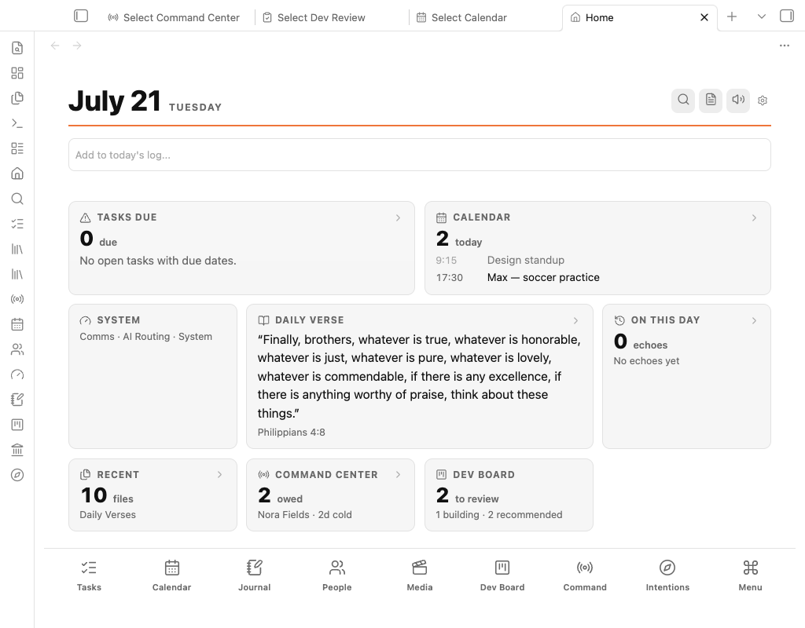

> 🎬 coming: the same surface on a phone

## Select Tasks + Board

A task application over ordinary Markdown checkboxes — no new task model, ever. Rows edit natively, subtasks nest, projects and people cross-link. The Board view adds a drag-and-drop kanban that is **pull-only** by design (the failure mode of every kanban is becoming the inventory). Its **Select lane** is the headline: drop a card there and an agent sweeps it within five minutes, drafts the work, and parks the card in Waiting with a link to a reviewable result note — including a "Needs from you" section for what it couldn't do.

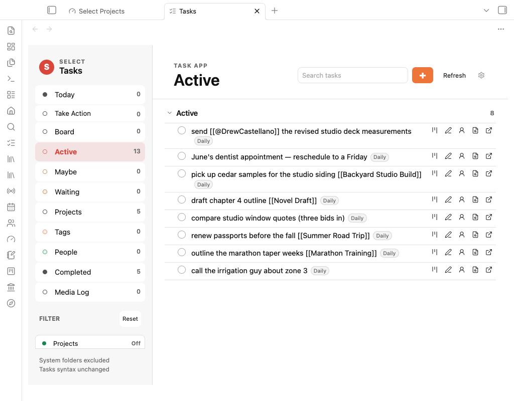

> 🎬 coming: a card dragged into the Select lane → draft note appears

## Media Log

The oldest subsystem and the origin of the whole project. Share a link from any device; an always-on server captures it — text first, so a crash can never drop a post — into one durable Markdown note per item. A library surface browses 2,500+ items with live embeds, tag/source/month filters, and per-item actions. A 1,517-post saved-media history was imported through the same production writer, inheriting every guarantee the pipeline had earned.

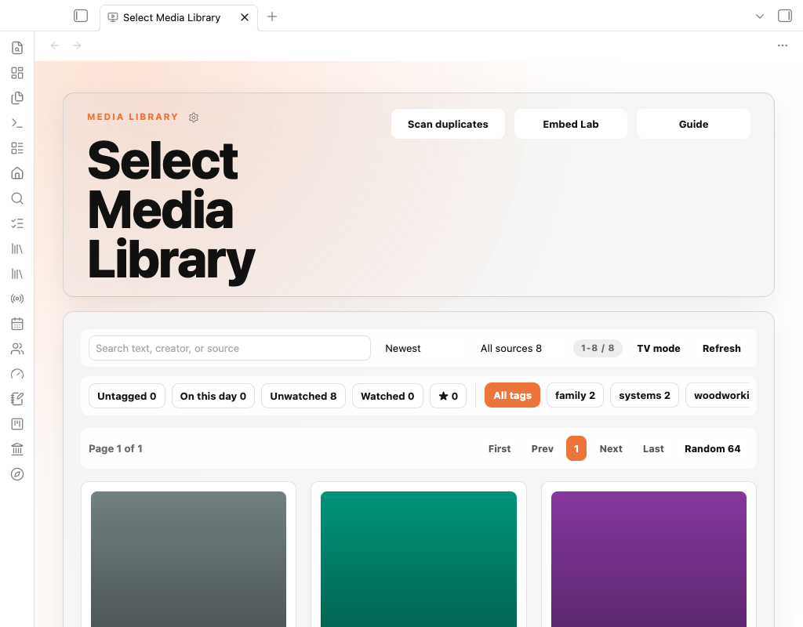

> 🎬 coming: phone share → item appears in the library

## Comms

Select has its own email address. Inbound mail hits a gateway on the server: allowlisted senders → AI triage → routed to schedule ingestion, note capture, or ignore — every decision audited, and message bodies treated as data, never instructions. **Missed Messages** watches iMessage for owed replies, resolves phone numbers to real names, and offers inline reply drafts delivered by an isolated, allowlisted sender. A channel registry governs every channel's enabled/reply flags in one place.

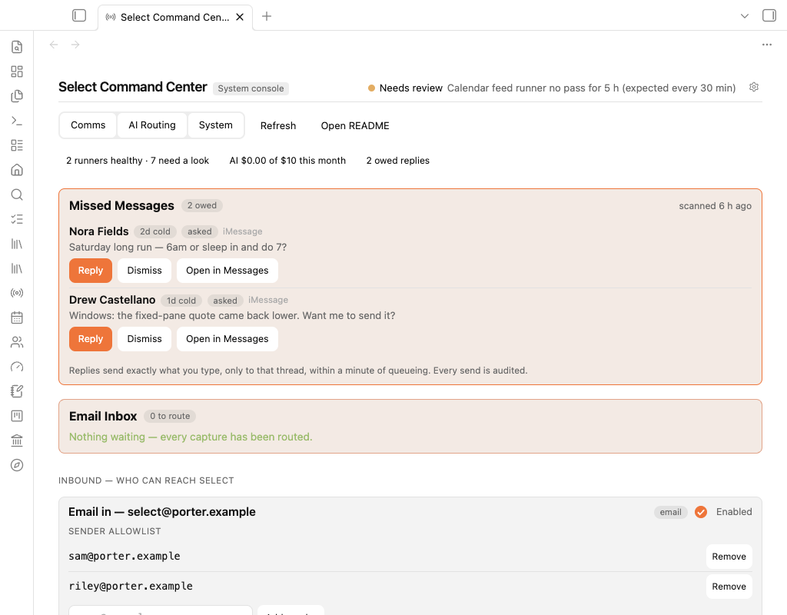

## Calendar + People

A read-only calendar layer ingests the family's calendars into a Today/Upcoming view and a week grid with a now-line — click any event to spawn its note. **Select People** is a CRM that demands zero data entry: mention someone anywhere in the vault and their dossier accrues — I-owe / waiting-on / agenda, a deep-linked mention timeline, calendar-fed contact history, and a Text action wired to Missed Messages.

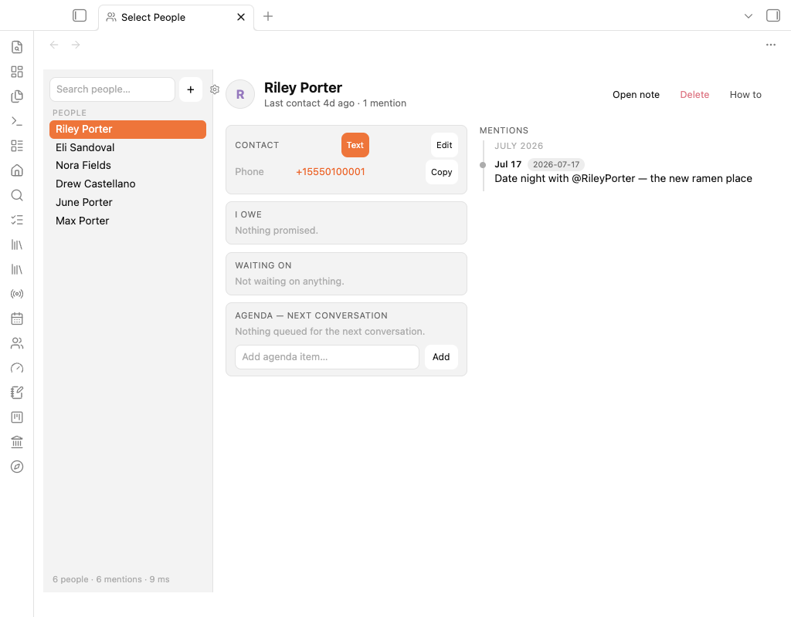

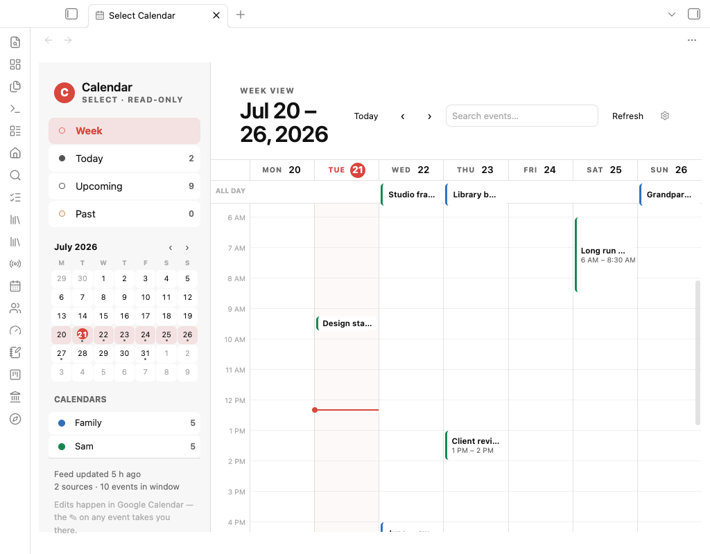

## Voice

Three escalating layers: the morning **Daily Brief** arrives as spoken audio (with a truncation guard that refuses to ship implausibly short files); **Ask Select** turns phone dictation into filed vault notes over a key-only, command-restricted tunnel — "Hey Siri" to librarian in one LTE round trip; **Thinking Time** records longer sessions, transcribes, auto-files daily items, and gates any project edit behind approval with a full action ledger.

> 🎬 coming: Siri shortcut → note lands in the vault

## Finances

Raw institution exports drop into a watched inbox folder; adapters normalize them into an atomic ledger — two years of transactions, every account balance, every investment position. Surfaces: net worth by institution with business-account toggles, month signals, income, and a stock benchmark seeded with true purchase lots reconciled to the penny, judged against an index from actual entry dates. Went from foundation to living balance sheet through nine versions in one afternoon.

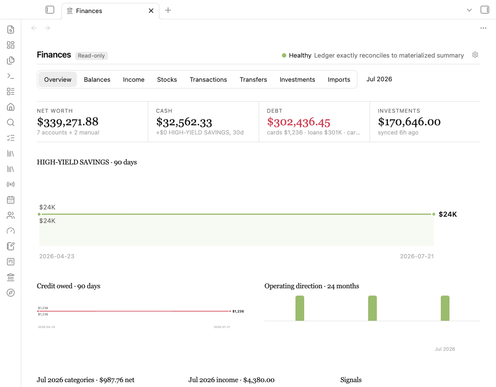

## Intentions

The yearly-goals review, rebuilt around **consent instead of staleness**: the review deals one goal or project at a time against its rendered note, and every verdict — next small step, snooze with a horizon, milestone, close — stamps the note and writes a journal line, so silent abandonment is structurally impossible. Session state rebuilds from the daily log itself; a mid-session restart recovered all nine decisions on its first live use.

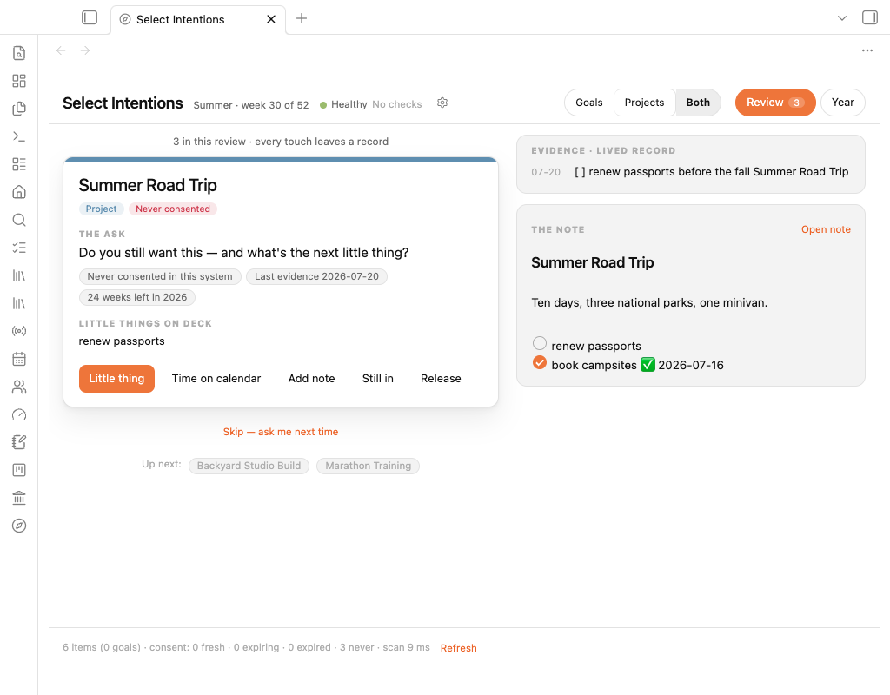

## Journal

Daily logs as a continuous timeline with a mini-month sidebar — today's entry is the real file in a live editor, past days mount the same editor on click. It replaced a twelve-year-old monthly-log convention the day it shipped.

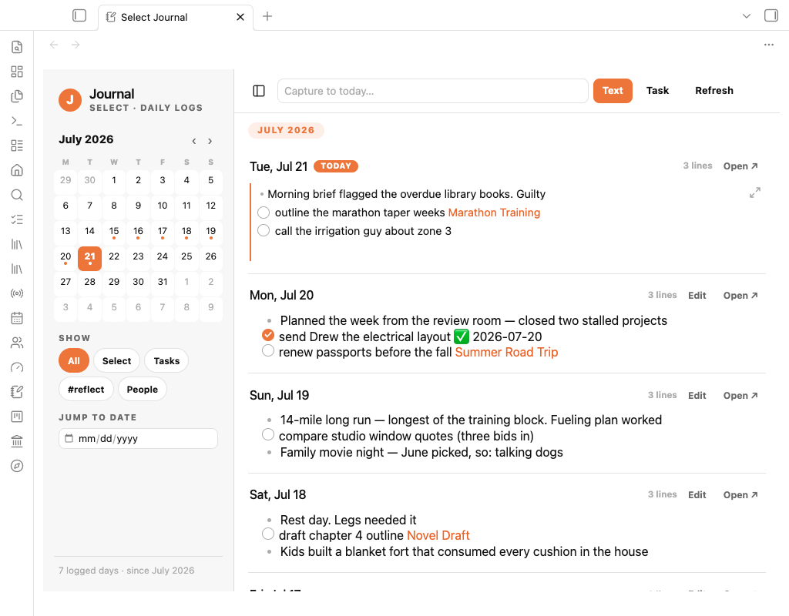

## Dev Dashboard

The dev cycle as a product. Agent recommendations are filed as cards the moment they're made — landing in a Recommended column the owner promotes from. Shipping requires an evidence note: status, what shipped, verification screenshots, and a numbered "your next step." A review room walks the Shipped column one card at a time with approve / needs-work / not-sold / reject routes. This board is how everything else in this document got built.

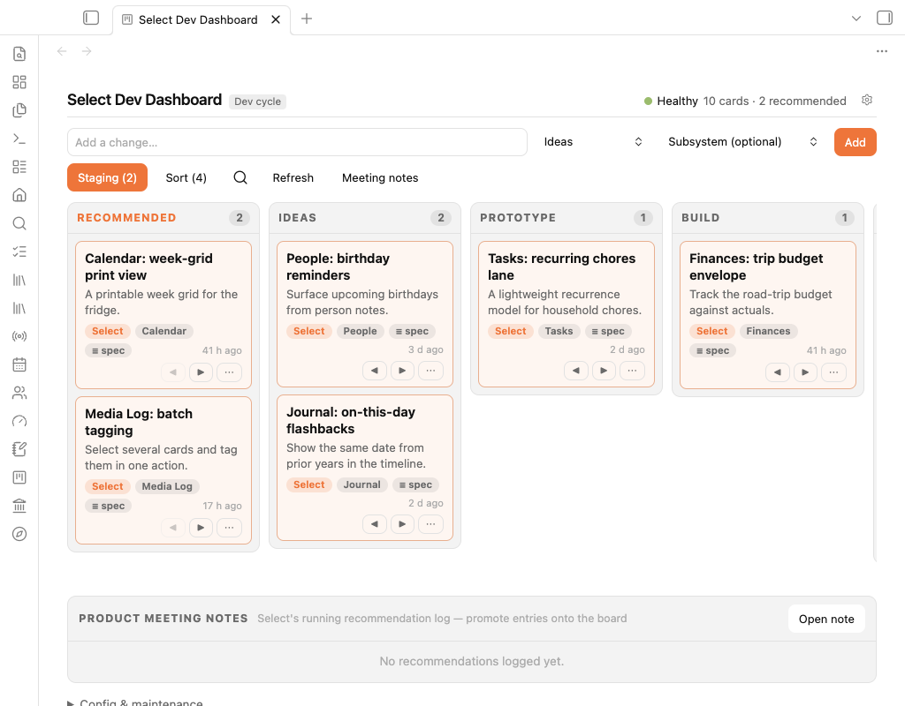

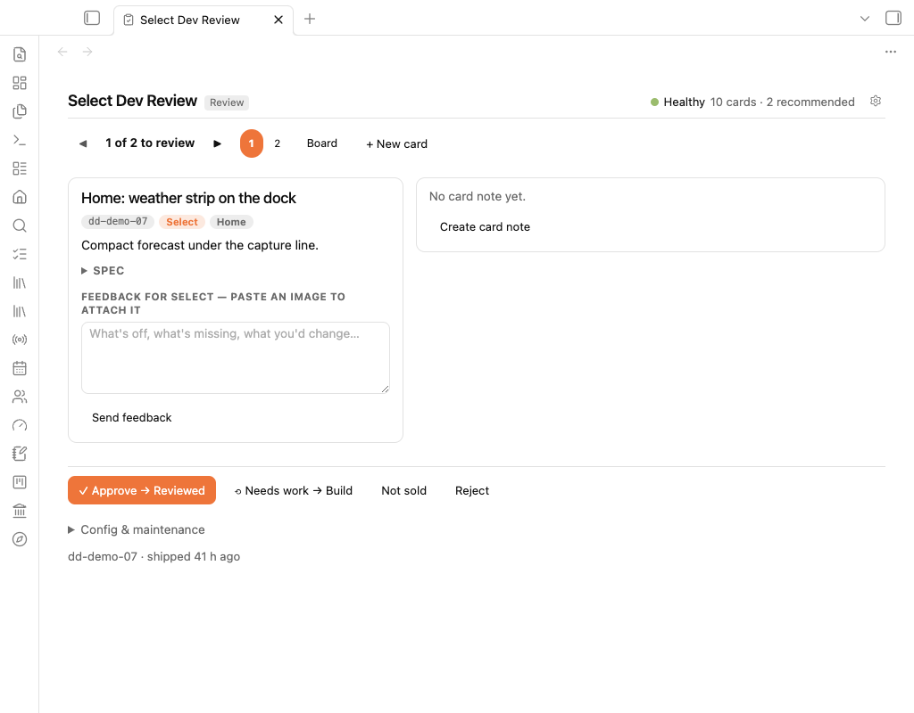

---

*Also in the family: a podcast-summarization runner, an OCR document-intake queue, a project cockpit with a forced-decision triage deck, an AI coaching council grounded in real session notes, a system-health console that vision-checks the server's own screen, and the style guide that keeps all of it looking like one product.*
