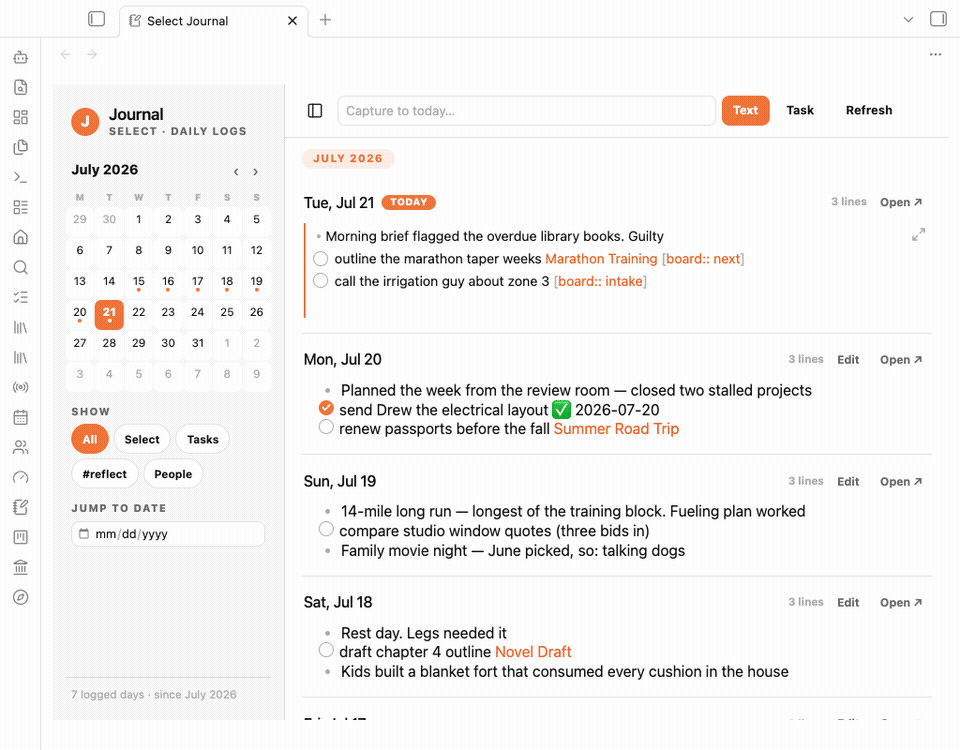
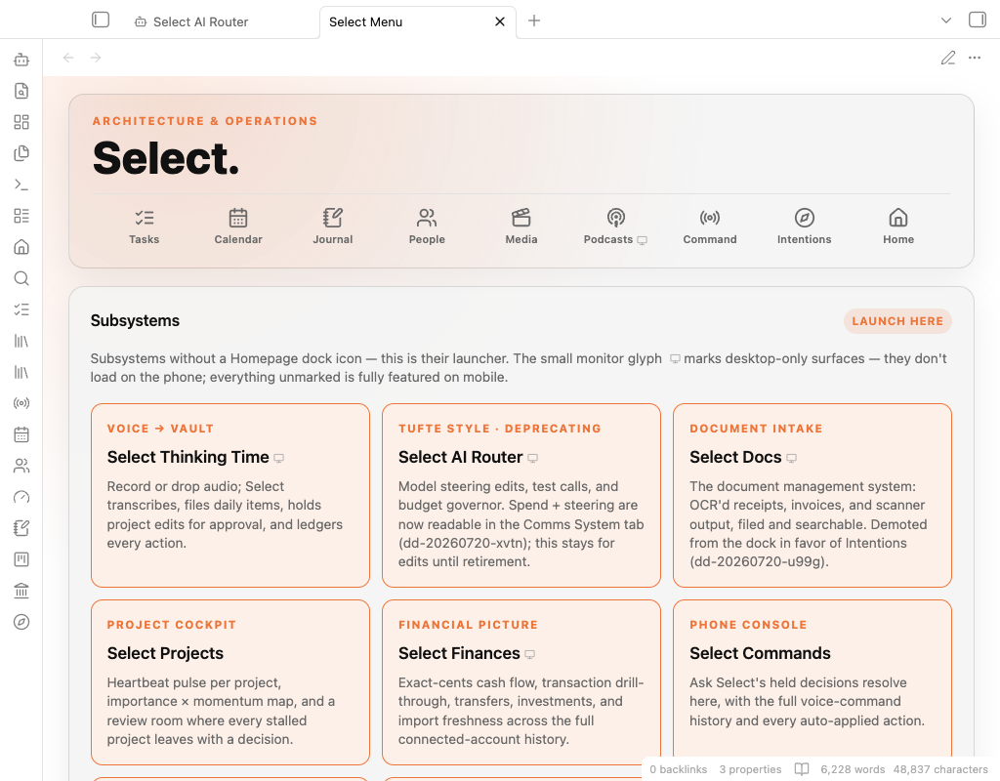
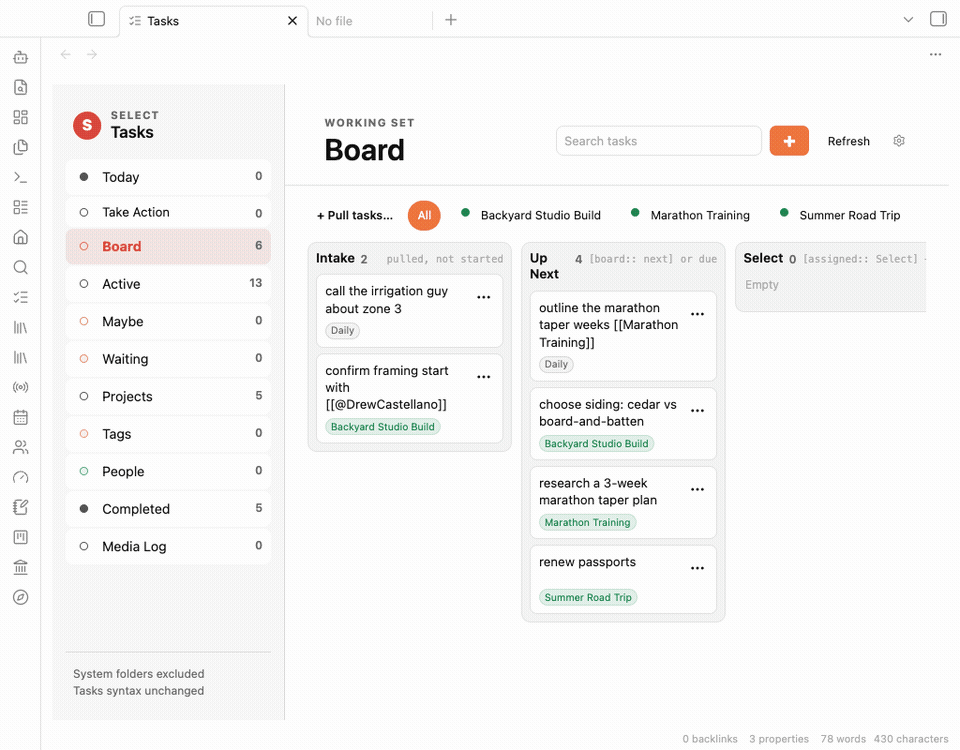
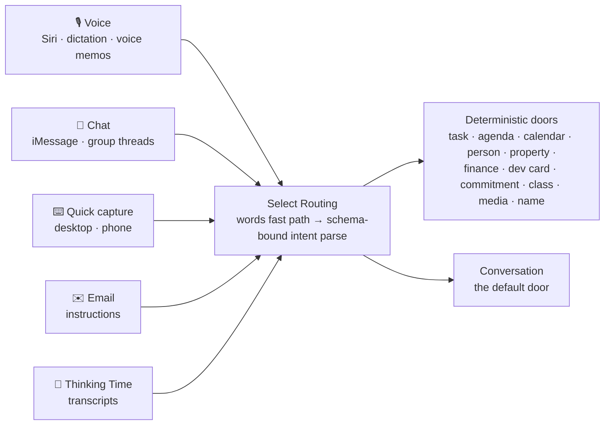
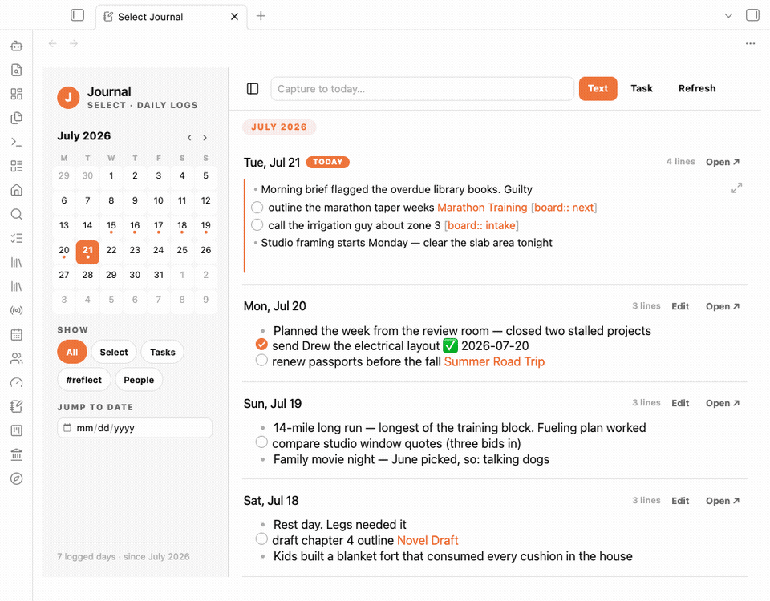
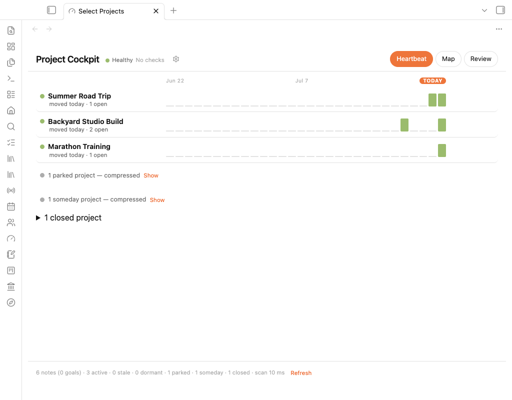

# Subsystem Tour

One section per subsystem. Every screenshot below is captured from a sanitized demonstration vault — a fictional family, fictional finances, fictional messages — running the real plugins. GIFs are still being recorded; remaining placeholders are marked.

---

## Select Home

The front door. A native homepage plugin with an app dock, a single-line quick capture, and a Daily Verse card drawn from a 247-verse curated rotation — with a one-tap **Reflect** action that journals the verse and your thought straight into the day's log. Mobile layout is first-class; a bento variant exists behind a setting.

The capture line goes straight into the day's journal:

## Select Menu

The launchpad — a plain Markdown note that behaves like an app screen. A dock of the daily surfaces up top, then a launcher card for every subsystem that doesn't earn a dock slot, each with its state and a one-line pitch. Because it's just a note, agents update it the way they update anything else: by editing text.

## Select Tasks + Board

A task application over ordinary Markdown checkboxes — no new task model, ever. Rows edit natively, subtasks nest, projects and people cross-link. The Board view adds a drag-and-drop kanban that is **pull-only** by design (the failure mode of every kanban is becoming the inventory). Its **Select lane** is the headline: drop a card there and an agent sweeps it within five minutes, drafts the work, and parks the card in Waiting with a link to a reviewable result note — including a "Needs from you" section for what it couldn't do.

The Select lane, end to end — a card enters the lane, Select drafts the work, the card parks in Waiting with the draft linked, and the draft ends with what it needs from you:

## Media Log

The oldest subsystem and the origin of the whole project. Share a link from any device; an always-on server captures it — text first, so a crash can never drop a post — into one durable Markdown note per item. A library surface browses 3,100+ items with live embeds, tag/source/month filters, and per-item actions. A 1,517-post saved-media history was imported through the same production writer, inheriting every guarantee the pipeline had earned. Since September, tags are suggested at capture time by an AI pass that can only choose from a closed vocabulary — budget-capped, behind a kill switch, and fail-open so a tagging outage never blocks a capture — and a keyboard-driven **sweep mode** walks the untagged backlog one item at a time. A menu-bar shortcut on the desktop sends the front browser tab into the same queue as the phone's share sheet.

> 🎬 coming: phone share → item appears in the library

## Select Media

The Media Log keeps what was *captured*; **Select Media** keeps what's *wanted*. A poster-gallery watchlist, a watched log grouped by month, a music shelf where each cover opens straight in the music service, and on/off tiles for the streaming subscriptions the household actually pays for. Posters and where-to-stream data come from a free, keyless lookup — no AI cost. The headline is **Tonight**: up to three titles you can play right now on services you already have, with a *deal again* button — and the same question texted ("what should we watch tonight?") gets the same answer. Things to watch are plain bullets in a note, never tasks, from every channel.

## Select Learn

Every subject the owner is studying becomes a **class**: one readable note holding a syllabus, a notebook, a study timeline, and every Media Log capture tagged to it. An *In process* strip shows what's being read or watched right now, straight from the note itself. Every add is undoable, there are no AI calls in the surface, and it works on the phone. The channels share one decision about what an input does to a class — "started reading X" or "finished X" texted, spoken, typed into Home, or entered on the page lands the same line in the same format, and a contract check fails the release if any channel bypasses the class writer. Questions asked about a course by text or voice are saved with their full answers. It went from first version to eleventh in two days, each version from a real use.

## Comms

Select has its own email address — and, since August, its own native iMessage line, running under a second account on the server so it texts from a real identity. That line is now the single chat spine: the earlier Telegram channel was retired by switching it off in the channel registry (restorable in two steps, not deleted), and the iMessage line earned its place with tested failure drills, a daily self-ping that proves a message actually arrives, and a sweep that recovers texts that died while the line was down. Inbound mail hits a gateway on the server: allowlisted senders → AI triage → routed to schedule ingestion, self-filing to known destinations, note capture, or ignore — every decision audited, and message bodies treated as data, never instructions. The iMessage line understands group threads — replying in the thread a message came from, refusing any thread with a member off the allowlist, and keeping private memory out of shared ones — and a second, bounded access tier lets household members use it for shared-life records without ever reaching code, configuration, money, or the owner's private thread. The morning task email is two-way too: a *Done* or *Not mine* per task, parsed deterministically with no AI call. On chat, **conversation is the default door**: anything not command-shaped gets a grounded, free-form reply (with photos read into words at the transport edge, and voice memos transcribed locally), while an Outbound audit shows every message Select sends — including the refused ones. **Missed Messages** watches iMessage for owed replies, resolves phone numbers to real names, and offers inline reply drafts delivered by an isolated, allowlisted sender. A channel registry governs every channel's enabled/reply flags in one place.

## Select Routing

The layer that makes every channel one channel. Whether a message arrives as a Siri dictation, an iMessage (alone or in a group thread), a quick-capture line typed on the phone, an emailed instruction, or a sentence inside a recorded thinking session, it funnels into the same parse-and-route core — **Select Routing** — and behaves identically. A voice memo is a text that started as breath; the owner should never have to remember which surface understands which phrasing.

The design has three load-bearing rules:

- **Words are a fast path, the model is the parser, the doors stay deterministic executors.** Cheap word-matching routes the obvious cases free; on a miss, a schema-bound intent pass names a door from the closed set and fills its slots — it never gets to write anything itself. Every write goes through the same deterministic primitives, person resolution never involves a model, and a trust gate means only a hand-marked inner circle can be matched by bare first name. Anything not command-shaped falls through to conversation, so a question is answered instead of mis-filed.
- **Channel parity is a hard rule, enforced by a gate.** One shared vocabulary and one fixture suite pin two synchronized implementations — server-side (voice, chat, email) and in-app (capture surfaces) — and a release gate replays **679 fixture checks across thirty-one channels, in both implementations, with no writes and no network**. A routing behavior change that lands in one channel and not the others fails the release.
- **Misses become fixtures, never vocabulary.** When a message takes the wrong door, the fix is not another trigger word (that buys one phrasing and leaves the failure class alive) — the correction is pinned as a regression fixture that both implementations must pass forever. Every routed action has a deterministic undo, and new doors ship behind kill switches that are rollbacks, not waiting periods.
- **Receipts only confirm what actually happened.** The reply names where a write landed, and it comes from the write result itself — a failed, duplicate, or ambiguous action says so and offers no undo. When the router is only guessing, the item goes to the day's log rather than a canonical record; replying "No — …" undoes and re-routes; and each door has its own intent schema, so the model can't even produce a slot the door wouldn't accept.

## AI Router

The spend and steering console for every AI call in the ecosystem. One shared config decides which model serves each surface (brief, triage, voice, test calls); a budget governor warns, downshifts to a cheaper model, and hard-stops; and every call lands in a shared ledger with its cost — so "add another AI surface" is a calm decision instead of a gamble. Spend readouts also surface in the Comms system console.

## Calendar + People

A read-only calendar layer ingests the family's calendars into a Today/Upcoming view and a week grid with a now-line — click any event to spawn its note — and since late August, events carry a meeting layer: attendees matched to person records, a capture door for meeting notes, and action items flowing into Tasks. **Select People** is a CRM that demands zero data entry: mention someone anywhere in the vault and their dossier accrues — I-owe / waiting-on / agenda, a deep-linked mention timeline, calendar-fed contact history, and a Text action wired to Missed Messages.

## Voice

Three escalating layers: the morning **Daily Brief** arrives as spoken audio (with a truncation guard that refuses to ship implausibly short files); **Ask Select** turns phone dictation into filed vault notes over a key-only, command-restricted tunnel — "Hey Siri" to librarian in one LTE round trip; **Thinking Time** records longer sessions, transcribes, auto-files daily items, and gates any project edit behind approval with a full action ledger.

> 🎬 coming: Siri shortcut → note lands in the vault

## Finances

Raw institution exports drop into a watched inbox folder; adapters normalize them into an atomic ledger — two years of transactions, every account balance, every investment position. Surfaces: net worth by institution with business-account toggles, month signals, income, and a stock benchmark seeded with true purchase lots reconciled to the penny, judged against an index from actual entry dates. Since August it's transaction-deep: every aggregated figure clicks through to its exact rows, the owner's own knowledge (payees, categories, rates the provider won't report) overlays the ledger at read time without ever rewriting it, and itemized retailer charges decompose into AI-categorized line items — with every view still reconciling to the cent. The Review tab now opens on a monthly report computed from the ledger at the moment it's viewed, with the owner's editorial notes kept as a separate layer and a subscription detector that only flags billing with real machine-like regularity. Rental-business accounting moved out to a surface of its own (below).

## Intentions

The yearly-goals review, rebuilt around **consent instead of staleness**: the review deals one goal or project at a time against its rendered note, and every verdict — next small step, snooze with a horizon, milestone, close — stamps the note and writes a journal line, so silent abandonment is structurally impossible. Session state rebuilds from the daily log itself; a mid-session restart recovered all nine decisions on its first live use. A **household meeting mode** runs the weekly couple's meeting live: agenda check-off, responses written into the day's log, standing items, and a close-the-meeting recap that carries anything uncovered to next week — where it reopens with a *last time* box showing what was said.

## Journal

Daily logs as a continuous timeline with a mini-month sidebar — today's entry is the real file in a live editor, past days mount the same editor on click. It replaced a twelve-year-old monthly-log convention the day it shipped.

## Dev Dashboard

The dev cycle as a product. Agent recommendations are filed as cards the moment they're made — landing in a Recommended column the owner promotes from. Shipping requires an evidence note: status, what shipped, verification screenshots, and a numbered "your next step." A review room walks the Shipped column one card at a time with approve / needs-work / not-sold / reject routes. This board is how everything else in this document got built.

## Also in the family

The tour above is the daily core, not the full roster. Sharing the same kit, style, and vault records:

- **The project cockpit** (shown above) — a heartbeat pulse per project, an importance × momentum map, and a triage deck where every stalled project leaves with a decision; now one mode of the Intentions room, its third home found after shipping standalone.
- **Podcast Runner** — submit an episode URL, get a staged, highlighted summary note with per-run cost accounting — opening with a Listen Decision brief: listen in full, listen to these timestamped stretches, or skip, and what you're not missing.
- **Select Docs** — OCR-first document intake: receipts, invoices, and scanner output, staged, routed, and searchable — with quote deadlines extracted into a standing expired-decisions queue.
- **Select Marketing** — a hub for a professional practice's social presence, organized around one question: *does posting start conversations?* This week, pipeline, assets (with a tag library any agent can read), brand, outputs, results.
- **The rental-business surface** — a small rental business shown in six rooms (health, performance, rent roll, cash and debt, decisions, records), computed read-only from retained accounting exports so every number drills through to ledger lines. Its only write is the expected rent. The records work behind it ran across many sessions and two AI engines through a shared handoff file — checksummed evidence, independent verifier scripts, every external write backed up and undoable.
- **The Select Lexicon** — the language built with the agents (modes of thinking, shorthand, component words, retired words), first mined from 130+ agent transcripts; a naming door adds a row whenever something gets named in any channel. With the Style Guide (the look) and the UX patterns (the behavior), it's the third reference: the words.
- **The Mastermind** — the coaching portal grown into a commitment system: every coach a CRM dossier with sessions, prep, and open promises; commitments have owners (a coach's own promises don't count as the owner's kept word); and AI seats spawn read-only agents that investigate the whole vault from the server.
- **Select Bible** — a Bible study subsystem: reading tracks, a free-reading interface with verse-tagged notes, and sermon capture — deliberately AI-free in version one, and the first app graded by the new single-app review format.
- **Server Watch** — the home server takes hourly screenshots of its own console and runs changed frames through a perceptual-diff-then-vision check, because status files only report what code thought to measure.
- **The Style Guide** — Select's visual languages documented side by side with live specimens, so twenty-four plugins read as one product.
